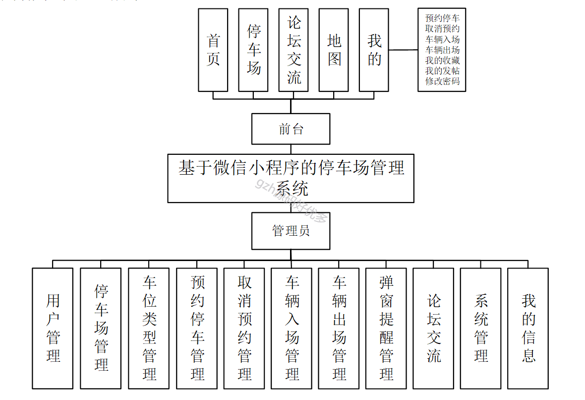

# mpweixinA075
mpweixinA075基于微信小程序的停车场管理系统
 
## 查看主页获取源码

### 一、作品包含

源码+数据库+设计文档万字+PPT+全套环境和工具资源+部署教程

### 二、项目技术

前端技术：Html、Css、Js、Vue2.0、Element-ui、uniapp
数据库：MySQL
后端技术：Java、SpringBoot2.0、MyBatis

  

### 三、运行环境

开发工具：IDEA/eclipse  + 微信开发者工具 + hbuilderx

数据库：MySQL5.7（最低要5.7版本）

数据库管理工具：Navicat10以上版本

环境配置软件： JDK1.8 + Maven3.6.3

前端Nodejs：16

浏览器：谷歌浏览器

### 四、项目介绍
项目编号：mpweixinA075

停车场管理系统是一种基于移动端的应用程序，旨在方便车主停车的事务办理。该小程序提供了便捷的停车和功能，使车主能够快速完成各项必要的手续和信息填写。旨在提供一种便捷、高效的预约停车方式，减少停车手续的时间和精力成本。通过该小程序，管理员可以更好地管理用户信息，提高工作效率，同时也为用户提供了更好的服务体验。
本文拟采用java技术和springboot搭建系统框架，后台使用MySQL数据库进行信息管理，设计开发的停车场管理系统。通过调研和分析，系统拥有管理员和用户两个角色，主要具备用户管理、停车场管理、车位类型管理、预约停车管理、取消预约管理、车辆入场管理、车辆出场管理、弹窗提醒管理、论坛交流、系统管理、我的信息等功能。将纸质管理有效实现为在线管理，极大提高工作效率。

### 五、运行截图

  
